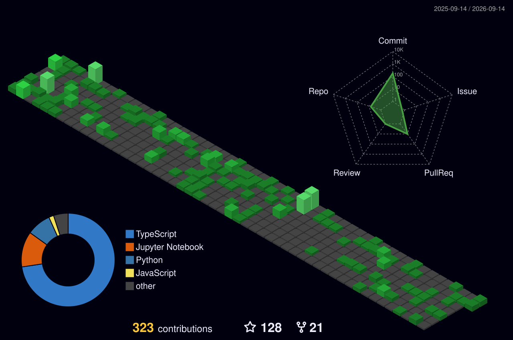

<h1> Hey, I’m Mihir! </h1>
  

<!--  -->

 

Hi, I’m Mihir Panchal, a researcher exploring Natural Language Processing, Large Language Models, Mechanistic Interpretability, and Graph Representation Learning. I am currently pursuing a Master of Computing in Artificial Intelligence at the National University of Singapore (NUS), where I am on the Dissertation Track. I have collaborated with leading institutions including Georgia Tech, King’s College London, National University of Singapore, IIT (ISM) Dhanbad, IIT Jodhpur, IIT Mandi, IIT Patna, DRDO, and NIDM, working across areas that bridge theoretical methods with real-world AI applications. My research interests span reasoning and interpretability in LLMs, memory-augmented and retrieval-augmented architectures, multi-agent systems, graph representation learning, multilingual NLP, and human-machine collaboration. I enjoy collaborating with researchers across disciplines and geographies and am always open to new opportunities that push the boundaries of AI, intelligent systems, and human-machine collaboration. Below is a non-exhaustive list of my current research interests. Feel free to reach out via your favorite platform :)

 

<ul>
<li> 🌱 I’m currently pursuing Masters of Computing in Artificial Intelligence at Nation University of Singapore </li>
<li> 💼 Wanna colab on Projects? do reach, <a href="mailto:mihirpanchal5400@gmail.com">email</a></li>
<li> 💬 Ask me about anything, I am happy to help </li>
<li> ⚡ Fun fact : The more you GRIND, the more you GET💫</li>
</ul>

  

<h2>Holopin Badges<h2>

<!--    -->

  
<h2>Mihir's Contribution Graph<h2>

 

<h2>GitHub Trophies<h2>

 
  
  
  

</a>

## 3D Contribution Calendar 📅
 

<h1>Github Contribution✨<h1>

