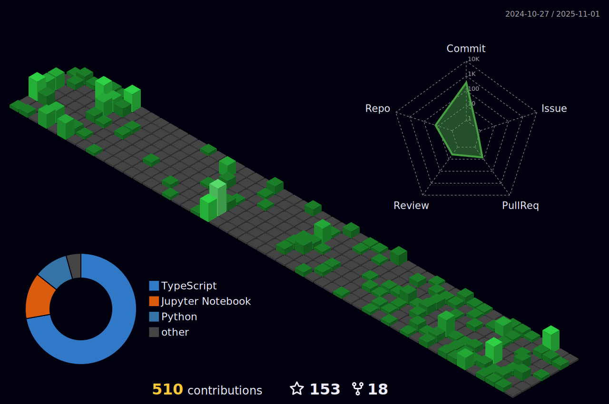

<h1> Hey, I’m Mihir! </h1>
  

<!--  -->

 

Hi, i'm Mihir Panchal,I am interested to work as a solution provider for Computer Software. Prefer in software development / automation / programming field having good skill in projects & design developments as well as handling all aspects of project management starts from creating demand, making it happen according to company structure.

<ul>
<li> 🌱 I’m currently pursuing BTech in Computer Engineering at Dwarkadas J. Sanghvi College of Engineering </li>
<li> 💼 Wanna colab on Projects? do reach, <a href="mailto:mihirpanchal5400@gmail.com">email</a></li>
<li> 💬 Ask me about anything, I am happy to help </li>
<li> ⚡ Fun fact : The more you GRIND, the more you GET💫</li>
</ul>

<h2>Holopin Badges<h2>

  
<h2>Mihir's Contribution Graph<h2>

 

<h2>GitHub Trophies<h2>

 
  
  
  

</a>

## 3D Contribution Calendar 📅
 

 

  

   
     
     
     
<!--   
  
   -->
  

<h1>Github Contribution✨<h1>

